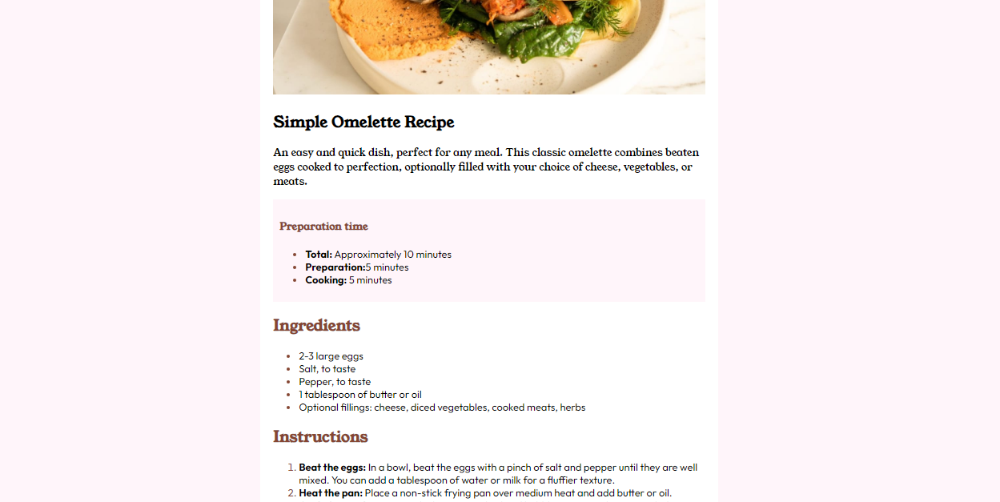
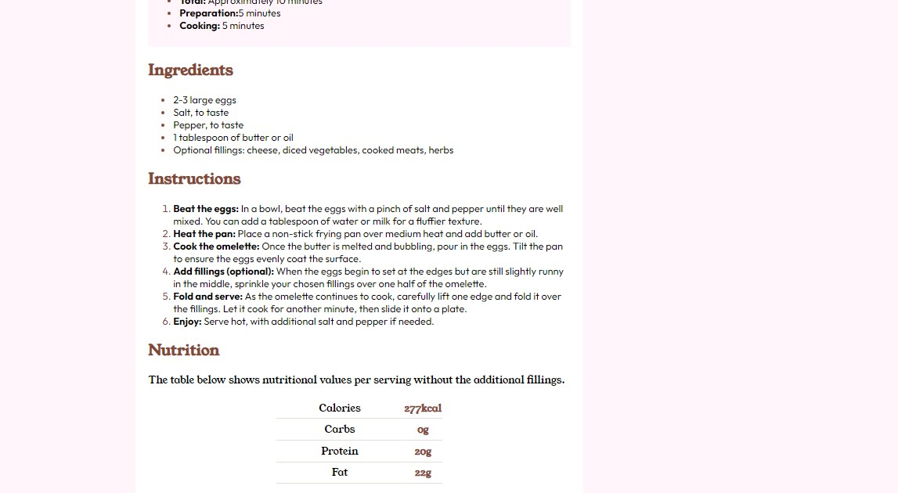

# Frontend Mentor - Recipe page solution

This is a solution to the [Recipe page challenge on Frontend Mentor](https://www.frontendmentor.io/challenges/recipe-page-KiTsR8QQKm). Frontend Mentor challenges help you improve your coding skills by building realistic projects. 

## Table of contents

- [Overview](#overview)
  - [The challenge](#the-challenge)
  - [Screenshot](#screenshot)
  - [Links](#links)
- [My process](#my-process)
  - [Built with](#built-with)
  - [What I learned](#what-i-learned)
  - [Continued development](#continued-development)
  - [Useful resources](#useful-resources)
- [Author](#author)
- [Acknowledgments](#acknowledgments)

## Overview
A responsive HTML,CSS website  recipe page designed to enlist ingredients,methods and equipmet required to make the dish.

### Screenshot




Screenshots of the output.

### Links

- Solution URL: (https://github.com/farwaayunis/recipe_blog.git)
- Live Site URL: (https://farwaayunis.github.io/recipe_blog/)

## My process
implement one element try to complete it 100%.then move to next.
### Built with

- Semantic HTML5 markup
- CSS custom properties
-RWD implementation

### What I learned

to access the odd/even column of table nthchild selector is used.

```html
<main>
  
  <!-- Main content of your webpage goes here -->
  <article>
  <h1>Simple Omelette Recipe</h1>

  <p>An easy and quick dish, perfect for any meal. This classic omelette combines beaten eggs cooked 
  to perfection, optionally filled with your choice of cheese, vegetables, or meats.</p>
</article>
```
```css
ol li::marker{color: hsl(14, 45%, 36%) ;}```
```


### Continued development

In future projects my focus would be responsive css design and learning how to write markdown read me.


### Useful resources

- ([https://www.w3schools.com](https://www.w3schools.com/css/css_rwd_intro.asp)) - This helped me in RWD . I really liked this pattern and will use it going forward.
- (https://www.https://www.semrush.com/blog/semantic-html5-guide/#why-do-i-need-to-use-semantic-html-tags.com) - This helped me in understanding difference between semantic and non-semantic html +i tried to use elements used in semantic html


## Author

- Website - https://github.com/farwaayunis/recipe_blog.git)
- Frontend Mentor - (https://www.frontendmentor.io/profile/farwaayunis)


